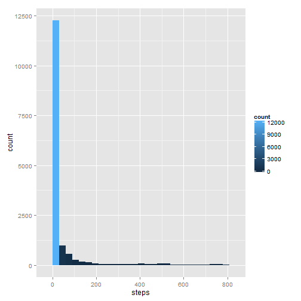
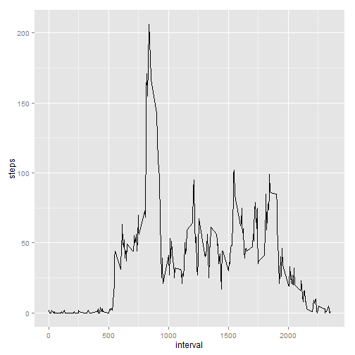
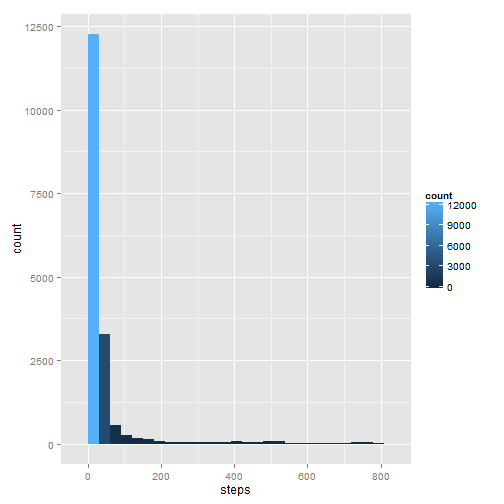
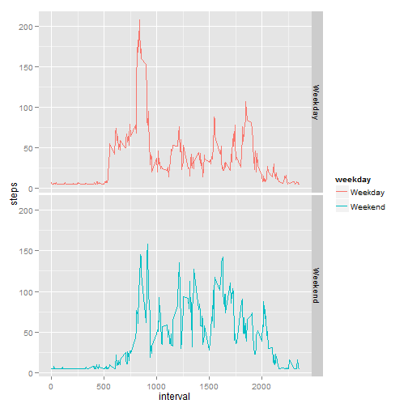

# Assesment 1 Reproducible Research
## Author: Gonzalo Andrés Moreno


### Loading and preprocessing the data

```r
setwd("D:/personal/data science/Reproducible Regression/Assesment1")
df<-read.csv("activity.csv", header=TRUE)
```

### Calculating mean and median of steps taken by day: 

An histogram of the steps is plotted  


```r
library(ggplot2)
qplot(steps, data=df, geom="histogram", fill=..count..,  binwidth=30)
```

 

Now, mean and median of the steps are calculated  


```r
mean.s<-mean(df$steps, na.rm=TRUE)
median.s<-median(df$steps, na.rm=TRUE)
```
The media is **37.3825996** and median es **0**

### Calculating the average daily activity pattron

First at all, the data is organized and rounded  


```r
average.s<-aggregate(steps~interval, data=df, mean)
average.s$steps<-round(average.s$steps,0)
```

When data are ready to be plotted we have a data.frame with **288** rows. We plotted the data:  

```r
qplot(interval,steps, data=average.s, geom="line")
```

 

```r
max.steps<-average.s[average.s$steps==max(average.s$steps),]
max.steps$interval
```

```
## [1] 835
```

```r
max.steps$steps
```

```
## [1] 206
```

The interval **835** has the maximum amount of steps (**206**)   

### Imputing missing values

the rows of df with NA´s are selected and calculated


```r
na.s<- df[is.na(df$steps),]
rows.na<-nrow(na.s)
rows.na
```

```
## [1] 2304
```

the file has **2304** rows in df. Now the Hmisc library is required to imput data.  Missing values are modified using the mean


```r
library(Hmisc)

## mean is used to impute data

imputed.df<-with(df, impute(df[,1],mean))
new.df<-df
new.df[,1]<-as.integer(imputed.df)
```

With the data imputed the histogram median and mean is calculated again

An histogram of the steps is plotted  


```r
qplot(steps, data=new.df, geom="histogram", fill=..count..,  binwidth=30)
```

 

Now, the new mean and median of the steps are calculated  


```r
new.mean.s<-mean(new.df$steps)
new.median.s<-median(new.df$steps)
```
The media is **37.3324226** and median es **0**. Imputing data did not affect the original media and mean.

### discoveryng activity patterns between weekdays and weekends 

Data is classified in weekday and weekend. Then steps are averaged


```r
library(timeDate)
new.df$weekday<-isWeekday(as.Date(new.df$date))
new.df[new.df$weekday==TRUE,4]<-"Weekday"
new.df[new.df$weekday==FALSE,4]<-"Weekend"
new.df.average<-aggregate(steps~interval+weekday, data=new.df, mean)
new.df.average$steps<-round(new.df.average$steps,0)

qplot(interval,steps, data=new.df.average,facets= weekday~., colour=weekday, geom="line")
```

 


    

